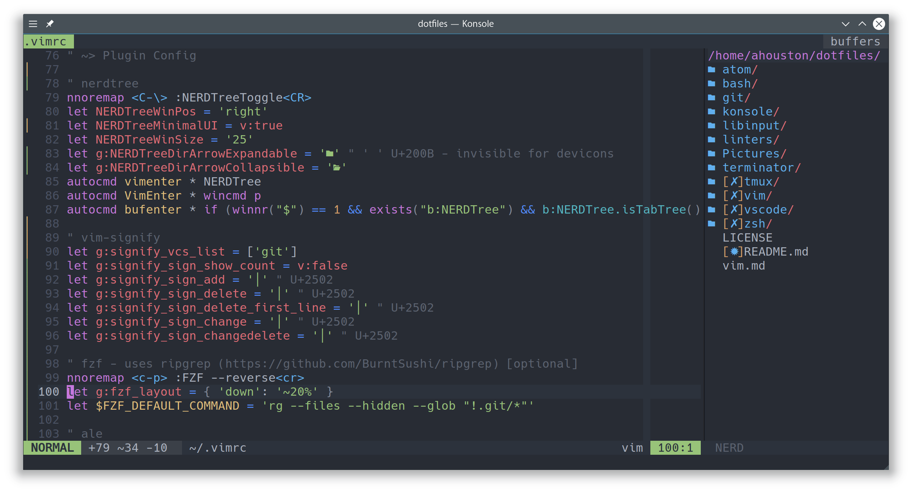

### **dotfiles**
> *my dotfiles for development on Linux*

[](https://getfedora.org/)
[](https://github.com/neovim/neovim)
[](https://github.com/zplug/zplug)
[](https://gnometerminator.blogspot.co.uk/p/introduction.html)
[](https://sourcefoundry.org/hack/)

For Vim help take a look at my [`vim.md`] which lists general, personal
and plugin keybinds. As well as every plugin I use.

## Usage
Structured to work with `GNU Stow`
```
$ git clone https://github.com/ahstn/dotfiles.git
$ cd dotfiles/
$ stow vim
```
etc, etc..

## Optional Dependencies
- [`vim-plug`] - vim plugin manager, used in my `.vimrc`
- [`zplug`] - zsh plguin manger, used in my `.zshrc`
- [`ripgrep`] - lightning fast grep, used in my `.vimrc` and `.zshrc`

## Appearance
- [`Aex Dark`] - plasma desktop theme
- [`La Capitaine`] - icon theme (dock and general)
- [`Latte Dock`] - dock used rather than a third party program

## Screenshot
Plasma (KDE) desktop as of the 8th of April 2018 - [`4d078ed`]


[N]Vim



### Acknowledgements
- [`meain`] - for layout inspo and vim config
- [`posquit0`] - for layout inspo

[`vim.md`]: vim.md
[`vim-plug`]: https://github.com/junegunn/vim-plug
[`zplug`]: https://github.com/zplug/zplug
[`ripgrep`]: https://github.com/BurntSushi/ripgrep
[`Aex Dark`]: https://store.kde.org/p/1207344
[`Ciliora-Teria`]: https://github.com/zagortenay333/ciliora-tertia-shell
[`La Capitaine`]: https://github.com/keeferrourke/la-capitaine-icon-theme
[`Latte Dock`]: https://github.com/psifidotos/Latte-Dock
[`4d078ed`]: https://github.com/ahstn/dotfiles/commit/4d078ededc7f3b803a18ddb80b26cddd85c529f5
